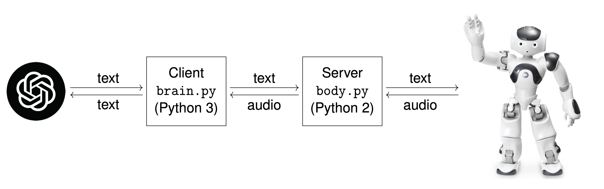

# NAO Meets GPT

## Overview

This project involves the integration of a NAO robot with an advanced language model (GPT) to enable sophisticated human-robot interactions. The system is divided into two main components: a Python server (`body.py`) that interacts directly with the NAO robot, and a Python client (`brain.py`) that handles speech-to-text processing, communication with GPT, and orchestrates the overall interaction by making requests to the server.

### `body.py`: Server Component
This component is responsible for interacting with NAO, i.e., text-to-speech,audio capture, and sending audio chunks to `brain.py` for speech-to-text processing. It uses the `NAOqi` framework for robot operations.

### `brain.py`: Client Component
This component runs separately and is responsible for speech recognition from the audio chunks as well as processing the recognized text using GPT. It sends the generated response from GPT to the server component for text-to-speech.

## Getting Started

### Requirements
- NAO Robot
- NAO Python SDK
- Python 3.x environment (for client component)
- Python 2.7 environment (for server component)
- Azure OpenAI API key for GPT access

### Setup
1. **Install the NAO Python SDK**: Follow the instructions [here](https://support.aldebaran.com/support/solutions/articles/80001017327-python-sdk-installation-guide) to install the NAO Python SDK.
2. **Python Environments**: Create two separate Python environments, one for the server component and one for the client component. The server component requires Python 2.7, while the client component requires Python 3.x. The specific Python versions and library versions used for each component are listed [here](requirements.txt).
3. **Install Dependencies**: Ensure all required Python libraries are installed in your environments.
4. **Configure Environment Variables**: Create a `.env` file and set your Azure API key and endpoint in this file. The `.env` file should look like this:
```
AZURE_OPENAI_KEY=e*******************************
AZURE_OPENAI_ENDPOINT=https://nameofyourendpoint.openai.azure.com/
```
1. **Turn on the NAO Robot**: Turn on the NAO robot and connect it to a router with an Ethernet cable.
2. **Connect to the Router**: Connect your machine to the router via Ethernet.
3. **Run the Server**: Run `body.py` in your Python 2.7 environment to start the Flask server. The server will manage audio input/output with the NAO robot.
4. **Run the Client**: Run `brain.py` in your Python 3.x environment. This script will start listening for speech, process it, and interact with GPT for generating responses.
5. **Talk to the NAO Robot**: Speak to the NAO robot. The system will capture your speech, transcribe it, and send it to GPT. The generated response from GPT will be spoken by the NAO robot.

### More details on the venv27 environment
There are probably many possible ways to do this, but here is one way that worked for us (on a 2019 MacBook Pro running macOS Sonoma 14.1.1):

Use the following command to create a Python 2.7 virtual environment:
```bash
/usr/local/bin/python2.7 -m virtualenv /path/to/your/venv27
```
Add the following convenience function to your .bash_profile:
```bash
function python27() {
    conda deactivate
    source /path/to/your/venv27/bin/activate
    export PYTHONPATH=${PYTHONPATH}:/path/to/naoqi-sdk/lib/python2.7/site-packages
    export DYLD_LIBRARY_PATH=${DYLD_LIBRARY_PATH}:/path/to/naoqi-sdk/lib
    export QI_SDK_PREFIX=/path/to/naoqi-sdk
    /path/to/your/venv27/bin/python2.7 "$@"
}
```
When you want to run the server component, use the `python27` command instead of `python` to activate the Python 2.7 environment:
```bash
python27 body.py
```

## License
This project is licensed under the MIT License - see the [LICENSE](LICENSE.txt) file for details.

## Citation
If you use this project in your research or work, please consider citing it:
```
@misc{naomeetsgpt2023,
  author = {Bosshard, Fabian and Meseret, Milion},
  title = {{NAO Meets GPT}},
  howpublished = {Project Thesis, Zurich University of Applied Sciences},
  year = {2023},
  url = {https://github.com/fabianbosshard/nao_meets_gpt/blob/main/project_thesis_corrected.pdf}
}
```

